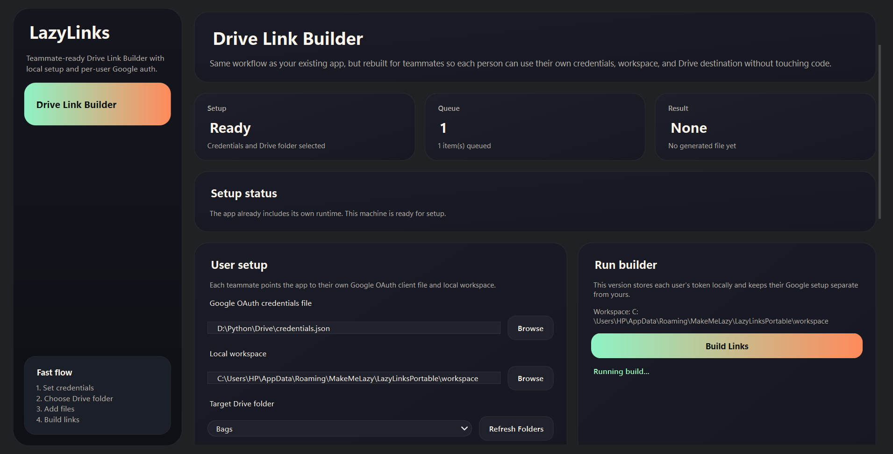
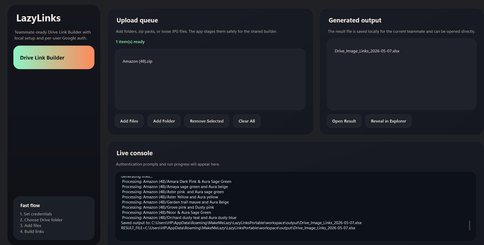
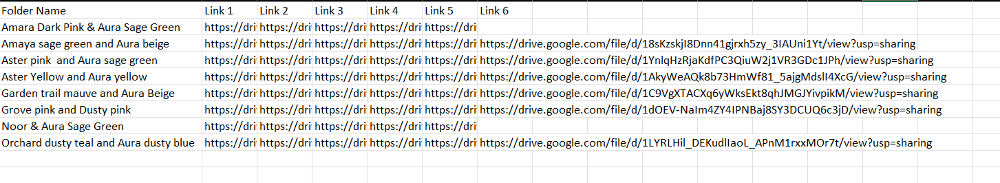

# LazyLinks

> *Because copy-pasting 200 Drive links by hand is not a workflow. It is a punishment.*

---

## The Job Nobody Talks About

Picture this. It is Monday morning. Your team just finished a product shoot - 15 SKUs, 5 images each. The catalogue sheet is due by noon.

So you open Google Drive.

You find the first folder. You right-click the first image. You hit *"Get link"*. You change the permission to *"Anyone with link"*. You copy it. You switch to your spreadsheet. You find the right row. You find the right column. You paste it.

Now you do that **74 more times.**

Not because it is complex. Not because it requires skill. Just because nobody has automated the part where a human being copies a link, switches windows, finds a cell, and pastes it. Over and over. While making sure the order is right, the SKU mapping is right, and nothing slips into the wrong column.

This is the quiet tax on every team that uses Google Drive for structured asset handoff.

---

## What Actually Goes Wrong

It is not just slow. It is fragile.

- You open **folder after folder manually**
- You check **file order by eye**
- You generate **shareable links one at a time**
- You **paste into sheets by hand**
- You **repeat the same process across every SKU, every product, every campaign**

By the time you are done, you are not sure if you got it right. So you check it again.

That is the real cost - not just the hour it takes, but the second hour you spend doubting the first.

---

## LazyLinks Was Built to End This

LazyLinks is a desktop app that turns repetitive Google Drive link handling into a fast, structured workflow.

You point it at your files. It handles the rest.

| Before LazyLinks | After LazyLinks |
| --- | --- |
| Open folders one by one | Upload a batch in one step |
| Check file order manually | Order is preserved automatically |
| Generate links one at a time | All links are generated in a single run |
| Paste into sheets by hand | Clean output sheet, ready to use |
| Repeat for every SKU | One build. Done. |

---

## Who This Is For

LazyLinks was born out of an e-commerce pain point - product listing teams preparing catalogue sheets with dozens of SKUs and hundreds of images. But the problem is broader than that.

Any team using Google Drive for asset handoff, campaign files, client delivery, or structured uploads can run into the same friction. If your work ever looks like this:

| Product | SKU | Img 1 | Img 2 | Img 3 | Img 4 | Img 5 |
| --- | --- | --- | --- | --- | --- | --- |
| Product A | SKU 1 | Link | Link | Link | Link | Link |
| Product A | SKU 2 | Link | Link | Link | Link | Link |
| Product B | SKU 1 | Link | Link | Link | Link | Link |
| Product B | SKU 2 | Link | Link | Link | Link | Link |

...and you are filling that sheet by hand, LazyLinks is for you.

---

## What It Does

- **Choose a Google Drive destination** inside the app
- **Upload folders, images, or zip packs** in a single step
- **Preserve ascending image order** automatically
- **Generate a clean output sheet** with mapped Drive links, folder by folder
- **Reduce manual mistakes** and the repetitive effort that causes them

The output works for marketplace listing, internal trackers, handoff sheets, campaign logs, and any workflow that depends on correctly ordered Drive links.

---

## How It Works

1. Drop in a local set of files or folders
2. LazyLinks uploads them into a structured Google Drive destination
3. It preserves the intended file sequence
4. It generates a ready-to-use output sheet with shareable links

---

## Screenshots

### App Overview

- Teammate-specific Google auth setup
- Upload queue and one-click build flow
- Generated output file inside the app
- Live console for run progress

### Example Output

LazyLinks produces a clean output sheet with ordered Drive links mapped folder by folder.

Screenshots live in [`assets/`](./assets).

---

## Demo

If you are a recruiter, product manager, operator, or collaborator and want to see it in action, reach out for:

- a live demo walkthrough
- screenshots and output samples
- limited build access

---

## Ownership

LazyLinks is owned and maintained by **Ayan Khan**.

X: [@AyanKhann15](https://x.com/AyanKhann15)

Copyright (c) 2026 Ayan Khan. All rights reserved.

---

## Repository Purpose

This is a public showcase repository for the product story, workflow, and use case. The implementation remains private.
